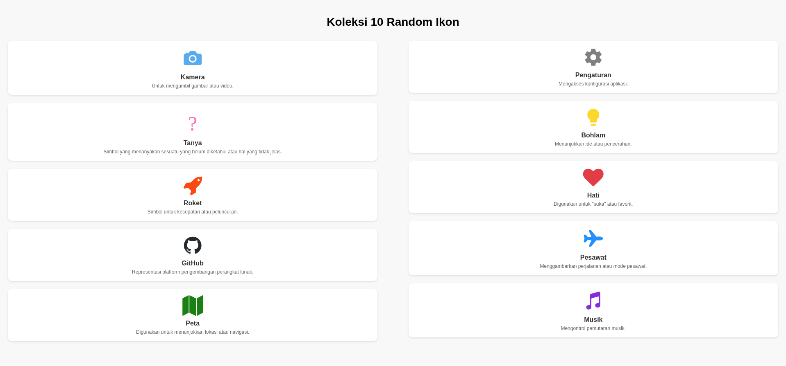

# Tugas 6: Tampilan 10 Ikon

Aplikasi ini adalah bagian dari tugas mata kuliah yang bertujuan untuk mendemonstrasikan pembuatan satu layar aplikasi mobile yang menampilkan 10 ikon berbeda.

## Fitur Utama

-   **Tampilan Ikon**: Menampilkan 10 ikon yang berasal dari pustaka `vector-icons` (seperti Ionicons, FontAwesome, dan MaterialIcons).
-   **Tata Letak Kolom**: Ikon-ikon disusun dalam dua kolom (kiri dan kanan), masing-masing berisi 5 ikon.
-   **Informasi Detail**: Setiap ikon dilengkapi dengan nama dan deskripsi singkat untuk menjelaskan fungsinya.
-   **Desain Sederhana**: Menggunakan komponen dasar React Native (`View`, `Text`, `ScrollView`) dan styling sederhana untuk tata letak yang bersih dan teratur.
-   **Kompatibilitas Expo**: Proyek ini dibuat menggunakan Expo, memastikan kompatibilitas dengan perangkat iOS dan Android.

## Struktur Proyek


Baik, terima kasih telah memberikan struktur folder yang baru. Saya akan menggunakannya untuk memperbarui README.md tugas ke-6 Anda.

Berikut adalah teks mentah Markdown yang sudah disesuaikan dengan struktur folder LAB-AKB-T6-MAIN Anda. Silakan salin dan tempelkan langsung ke file README.md Anda.

Markdown

# LAB-AKB-T6-MAIN: Tampilan 10 Ikon

Aplikasi ini adalah bagian dari tugas mata kuliah yang bertujuan untuk mendemonstrasikan pembuatan satu layar aplikasi mobile yang menampilkan 10 ikon berbeda.

## Fitur Utama

-   **Tampilan Ikon**: Menampilkan 10 ikon yang berasal dari pustaka `vector-icons` (seperti Ionicons, FontAwesome, dan MaterialIcons).
-   **Tata Letak Kolom**: Ikon-ikon disusun dalam dua kolom (kiri dan kanan), masing-masing berisi 5 ikon.
-   **Informasi Detail**: Setiap ikon dilengkapi dengan nama dan deskripsi singkat untuk menjelaskan fungsinya.
-   **Desain Sederhana**: Menggunakan komponen dasar React Native (`View`, `Text`, `ScrollView`) dan styling sederhana untuk tata letak yang bersih dan teratur.
-   **Kompatibilitas Expo**: Proyek ini dibuat menggunakan Expo, memastikan kompatibilitas dengan perangkat iOS dan Android.

## Struktur Proyek

.
├── .expo

├── .vscode

├── app

│   ├── _layout.tsx

│   └── index.tsx

├── assets

│   └── images

│       └── hasilbuild.png

├── node_modules

├── .gitignore

├── app.json

├── eslint.config.js

├── expo-env.d.ts

├── package-lock.json

├── package.json

├── README.md

└── tsconfig.json

## Teknologi yang Digunakan

-   **React Native**: Kerangka kerja untuk membangun aplikasi mobile.
-   **Expo**: Platform yang mempermudah pengembangan aplikasi React Native.
-   **@expo/vector-icons**: Kumpulan ikon yang terintegrasi dengan Expo.

## Cara Menjalankan Aplikasi

1.  Pastikan Anda telah menginstal semua dependensi proyek.
2.  Jalankan aplikasi di mode pengembangan:
    ```bash
    npx expo start
    ```
3.  Pindai kode QR yang muncul di terminal dengan aplikasi Expo Go di ponsel Anda, atau jalankan di emulator.

---

Terima kasih.



